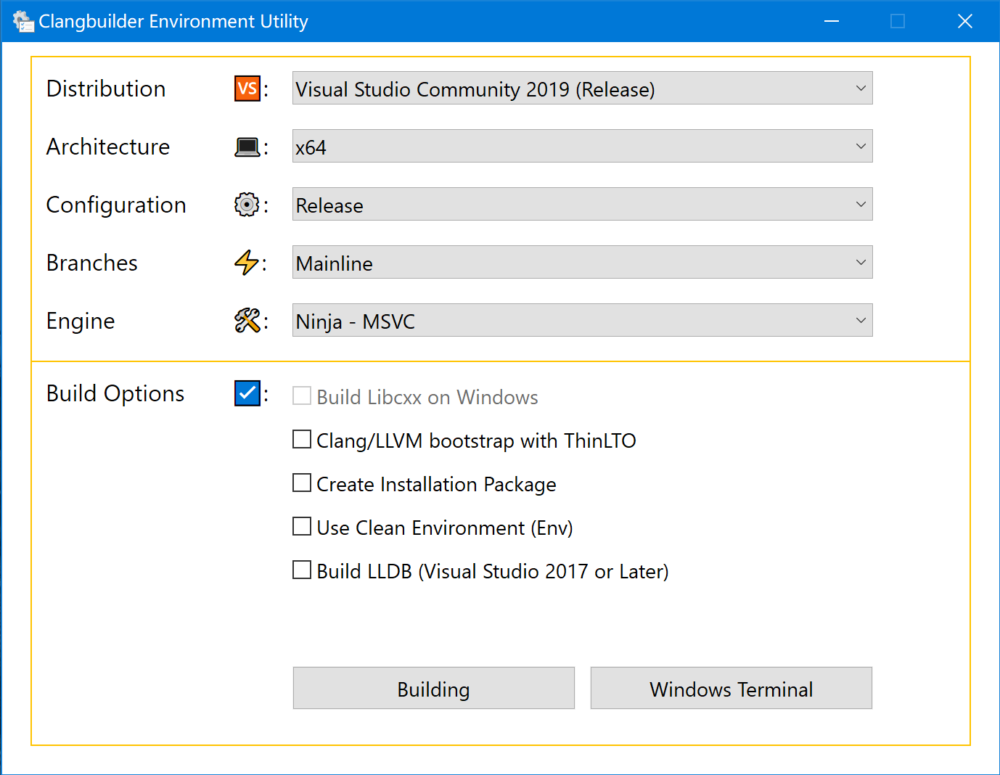

# Clangbuilder

Automated tools help developers on Windows platforms building LLVM and clang.
 
## Installation

### PowerShell Policy

Often you need to change the Power Shell execution policy

```powershell
Get-ExecutionPolicy
```

**Output**:

> Restricted

Please run PowerShell with administrator rights, and Enter:   

```powershell
Set-ExecutionPolicy RemoteSigned
```

### General Setup

Clone clangbuilder on Github

```shell
git clone https://github.com/fstudio/clangbuilder.git clangbuilder
```

Click the `script/InitializeEnv.bat`

The installation script will compile ClangbuilderUI and create a shortcut, download required packages.

If your need install `VisualCppTools.Community.Daily` ,click `script/VisualCppToolsFetch.bat`


## Use Powershell Core

Your can install powershell core and use it as `Execution Engine`.

**Step**
1.  Download Powershell Core [https://github.com/PowerShell/PowerShell/releases](https://github.com/PowerShell/PowerShell/releases)
2.  Install PowerShell Core, (Add to Environment)
3.  Create `required_pwsh` in `$ClangbuilderRoot\bin`

## Build Clang on Windows

Clangbuilder Now Only support use Visual C++ build Clang LLVM LLDB. 

Best Visual Studio Version:

>Visual Studio 2017 15.5 or later

You can run ClangbuilderUI, Modify Arch, Configuration and other options. after click `Building`

**ClangbuilderUI Snapshot**



**Update 2017-08-19** Clangbuilder support **VisualCppTools.Community.Daily**:


**VisualCppTools.Community.Daily** current not support msbuild (becasue cmake ...)

**Update 2017-09-17** ClangbuilderUI Support EWDK


**Branch**

+  Mainline, master/trunk branch , git fetch from https://github.com/llvm-mirror/
+  Stable, llvm stable branch, like release_60, git fetch from https://github.com/llvm-mirror/
+  Release, llvm release tag, download for https://releases.llvm.org/


**CMake Custom flags**

You can custom cmake build flags Now !!!

Clangbuilder will check `$ClangbuilderRoot\out\cmakeflags.$Branch.json` and `$ClangbuilderRoot\out\cmakeflags.json` is exists, if exists parse cmake flags.

The corresponding branch takes effect:

```txt
cmakeflags.mainline.json
cmakeflags.stable.json
cmakeflags.release.json
```

Set `cmakeflags.json` will take effect in all branches (Mainline, Stable, Release)

Flags configuration format is json:

```json
{
    "CMake":[
        "-DCMAKE_INSTALL_PREFIX=\"D:/LLVM\""
    ]
}
```


**Engine**

+   MSbuild use msbuild build llvm
+   Ninja use ninja build llvm
+   NinjaBootstrap use ninja build and bootstrap llvm
+   NinjaIterate use ninja build llvm, but compile is prebuilt clang (config by `config\prebuilt.json`)

[prebuilt.json template](./config/prebuilt.template.json):
```json
{
    "LLVM": {
        "Path": "D:/LLVM",
        "Arch": "x64"
    }
}
```

**LLDB**

When you select build LLDB, If not found Python 3 installed. Clangbuilder add flag `-DLLDB_DISABLE_PYTHON=1`.

LLDB maybe not work.

**Libc++**

Only NinjaBootstrap and NinjaIterate will compile libc++ ,Because Visual C++ not support `include_next` now.

```powershell
clang-cl -std:c++14  -Iinclude\c++\v1 hello.cc c++.lib
```

after copy `c++.dll` to your path(or exe self directory). 

**Libcxx C++17(vcruntime)**: 7.0 support C++17; 6.0 please use [libcxx-msvc-cxx17.patch](https://github.com/fstudio/clangbuilder/blob/master/sources/patch/libcxx-msvc-cxx17.patch).


**ARM64**

Build LLVM for ARM64 is broken, But You can download **Enterprise WDK (EWDK) Insider Preview** from https://www.microsoft.com/en-us/software-download/windowsinsiderpreviewWDK ,When you config `config/ewdk.json`, ClangbuilderUI able to start `ARM64 Environment Console`

[ewdk.json template](./config/ewdk.template.json):
```json
{
	"Path":"D:\\EWDK",
	"Version":"10.0.16257.0"
}
```

*Update*: Visual Studio 15.4 can install `Visual C++ compilers and libraries for ARM64`， CMake 3.10 start support ARM64. 

See: [VS15: Adds ARM64 architecture support.](https://gitlab.kitware.com/cmake/cmake/merge_requests/1215)


**Use Clean Environment**

Clangbuilder support `Clean Environment`, When use `-ClearEnv` flag or enable check box `Use Clean Environment`, Clangbuilder will retset `$env:PATH`.

```powershell
Function ReinitializePath {
    if ($PSEdition -eq "Desktop" -or $IsWindows) {
        $env:PATH += "${env:windir};${env:windir}\System32;${env:windir}\System32\Wbem;${env:windir}\System32\WindowsPowerShell\v1.0"
    }
    else {
        $env:PATH = "/usr/local/bin:/usr/bin:/bin"
    }
}

```


## Commandline

```cmd
.\bin\clangbuilder
```

## Custom PATH

You can modify [config/initialize.json](./config/initialize.json) , add some directories to PATH. Note that directories have **higher priority** in PATH. (Insert Front)
 

## Suggest

+   Best Platform is Windows 10 x64 
+   Select `Use Clean Environment` will reset current process Environment PATH value, Resolve conflict environment variables
+   If your will build lldb, your should install python3.

```powershell
$env:Path = "${env:windir};${env:windir}\System32;${env:windir}\System32\Wbem;${env:windir}\System32\WindowsPowerShell\v1.0"
```
`$evn:windir` is usually `C:\Windows`

## Environment Console

When you only need to start a console environment, you can click on the `Environment Console`.


## Add Portable Utilities

You can port some tools to clangbuilder, see `ports`
and then double-click `script/DevAll.bat` to the software you need as part of the Clangbuilder is added to the environment. Clangbuilder 6.0 support `devi`, You can run devi under `Environment Console`, use `devi install $ToolName` to install your need tools.

Usage: 

```txt
devi portable package manager 1.0
Usage: devi cmd tool_name
       list        list installed tools
       search      search ported tools
       install     install tools
       upgrade     upgrade tools
       version     print devi version and exit
       help        print help message
```

Default installed tools:

```json
{
    "core": [
        "7z",
        "cmake",
        "git",
        "ninja",
        "nsis",
        "nuget",
        "python2",
        "vswhere"
    ]
}
```

Current ported tools:

```txt
7z                  18.05               7-Zip is a file archiver with a high compression ratio
ag                  2018-04-24/2.1.0    A code-searching tool similar to ack, but faster.
aria2               1.33.1              The ultra fast download utility
cmake               3.11.1              CMake is an open-source, cross-platform family of tools designed to build, test and package software
curl                7.59.0              Curl is a command-line tool for transferring data specified with URL syntax.
git                 2.17.0              Git is a modern distributed version control system focused on speed
gnuutils            1.0                 GNU utils for Windows
hg                  4.5.2               Mercurial is a free, distributed source control management tool.
nasm                2.13.03             NASM - The Netwide Assembler
neovim              0.2.2               Neovim - Vim-fork focused on extensibility and usability
ninja               1.8.2               Ninja is a small build system with a focus on speed.
nsis                3.03                NSIS (Nullsoft Scriptable Install System) is a professional open source system to create Windows installers.
nuget               4.6.2               NuGet is the package manager for .NET. The NuGet client tools provide the ability to produce and consume packages.
openssh             v7.6.1.0p1-Beta     Portable OpenSSH
perl5               5.26.1.1            Perl 5 is a highly capable, feature-rich programming language.
putty               0.70                PuTTY: a free SSH and Telnet client.
python3             3.5.4               Python is a programming language.
radare              2.5.0               unix-like reverse engineering framework and commandline tools
ripgrep             0.8.1               ripgrep recursively searches directories for a regex pattern.
swigwin             3.0.12              Simplified Wrapper and Interface Generator
vswhere             2.4.1               Locate Visual Studio 2017 and newer installations.
wget                1.19.4              A command-line utility for retrieving files using HTTP, HTTPS and FTP protocols.
```

**Extensions**:

We support 4 extensions: `exe`, `zip`, `msi`, `7z`. If 7z is not installed, only the first three extensions are supported. If you need to port a 7z extension type of package, you need to understand the decompression format supported by 7z.exe.

>7z.exe supported formats(Unpacking): AR, ARJ, CAB, CHM, CPIO, CramFS, DMG, EXT, FAT, GPT, HFS, IHEX, ISO, LZH, LZMA, MBR, MSI, NSIS, NTFS, QCOW2, RAR, RPM, SquashFS, UDF, UEFI, VDI, VHD, VMDK, WIM, XAR and Z


## Add Extranl Libs

You can add extranl lib, such as [z3](https://github.com/Z3Prover/z3),
download extranl lib, unpack to `bin/external` , `bin/external/include` is include dir, `bin/external/lib/$arch(x86,x64,arm,arm64)`, `bin/external/bin/$arch(x86,x64,arm,arm64)`.

## About Ninja Task

**Ninja Task Parallel:**

```powershell
Function Parallel() {
    $MemSize = (Get-WmiObject -Class Win32_ComputerSystem).TotalPhysicalMemory
    $ProcessorCount = $env:NUMBER_OF_PROCESSORS
    $MemParallelRaw = $MemSize / 1610612736 #1.5GB
    #[int]$MemParallel = [Math]::Floor($MemParallelRaw)
    [int]$MemParallel = [Math]::Ceiling($MemParallelRaw) ## less 1
    return [Math]::Min($ProcessorCount, $MemParallel)
}
```

## Copyright

License: MIT  
Author: Force.Charlie  
Copyright © 2018 Force Charlie. All Rights Reserved.

